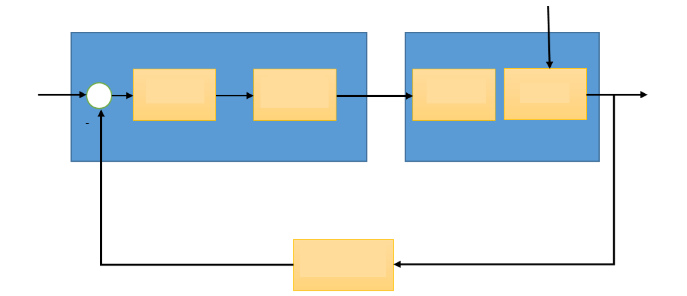
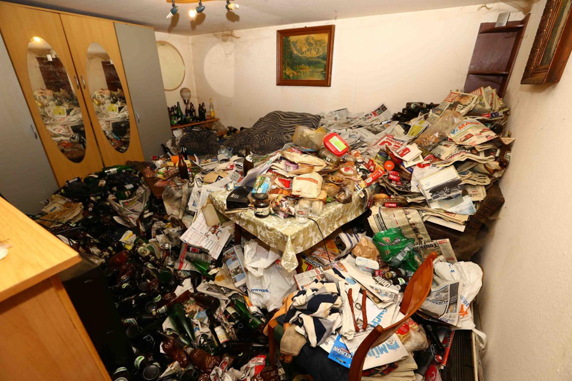
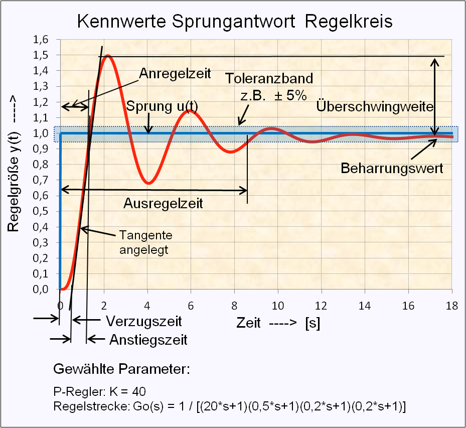
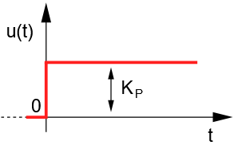
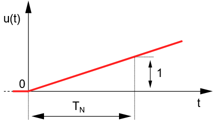
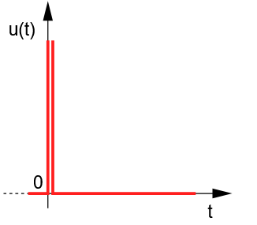
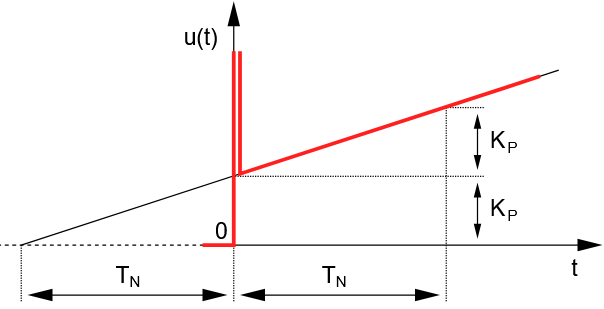

<!--
author: Benjamin Pietke
email: pietke@bszbautzen.de
comment: Lernfeld 7 - Mechatronik: Dieser Online-Kurs dient zur Unterstützung im Lernfeld-Unterricht am BSZ Bautzen.
logo: ./bilder/logo-lf7.png
icon: ./bilder/icon-bsz.png
classroom: enable
-->

# Mechatronische Teilsysteme

## Einführung

## Sensorik

## Baugruppen eines Netzteils

### Transformator

### Gleichrichter

#### Halbleiterbauelemente

### Glättung

### Stabilisierung

## Steuer- und Regelungstechnik

Herzlich willkommen im Abschnitt zu Regelungstechnik! 🎓

In der Ausbildung zum Mechatroniker ist dieses Thema unerlässlich, da es euch grundlegende Prinzipien zur Steuerung und Regelung komplexer Systeme vermittelt.

Ihr lernt, wie Systeme automatisch reguliert werden, um Istwerte und Sollwerte richtig abzustimmen. 📏 Dabei spielt die Erfassung von Daten durch Sensoren und die Verarbeitung dieser Informationen zur Anpassung von Steuerungen eine zentrale Rolle. 🎛️

Ein wichtiger Aspekt ist das Verständnis von Regelkreisen und deren Komponenten. Ihr erfahrt, wie diese in verschiedenen Anwendungen, wie Industrieanlagen und Automatisierungssystemen, eingesetzt werden. 🔧 Zudem werdet ihr praktische Übungen durchführen, um euer theoretisches Wissen anzuwenden und zu vertiefen. 💻🔍

Die Kenntnisse in der Regelungstechnik sind entscheidend für eure berufliche Entwicklung und für die Effizienz moderner technischer Systeme. 🌍 Seid bereit, spannende Themen zu erkunden und euer Wissen zu erweitern!

Viel Spaß beim Lernen! 📚✨


### Steuern vs. Regeln

Für ein erstes Verständnis zum Thema Regelungstechnik ist es wichtig, den technischen Unterschied zwischen "Steuern" und "Regeln" zu verinnerlichen.


Lesen Sie die beiden Definition nach DIN IEC 60050-351:

**Steuerung**

*"Das Steuern, die Steuerung, ist ein Vorgang in einem System, bei dem eine oder mehrere Größen als Eingangsgrößen, andere Größen als Ausgangs- bzw. Steuergrößen aufgrund der dem System eigentümlichen Gesetzmäßigkeiten beeinflussen.*

*Kennzeichen für das Steuern ist entweder der offene Wirkungsweg oder ein zeitweise geschlossener Wirkungsweg, bei dem die durch die Eingangsgrößen beeinflussten Ausgangsgrößen nicht fortlaufend und nicht wieder über dieselben Eingangsgrößen auf sich selbst wirken."*

**Regelung**

*"Die Regelung bzw. das Regeln ist ein Vorgang, bei dem fortlaufend eine Größe, die Regelgröße, erfasst, mit einer anderen Größe, der Führungsgröße, verglichen und im Sinne einer Angleichung an die Führungsgröße beeinflusst wird.*

*Kennzeichen für das Regeln ist der geschlossene Wirkungsablauf, bei dem die Regelgröße im Wirkungsweg des Regelkreises fortlaufend sich selbst beeinflusst."*

<!-- style="background-color: salmon;"-->
> **📝 AUFGABE**
>
> Grenzen Sie die Begriffe "Steuerung" und "Regelung" mit Ihren eigenen Worten gegeneinander ab.


<!-- style="background-color: salmon;"-->
> **📝 AUFGABE**
>
> Erläutern Sie anhand der folgenden Beispiele den Unterschied zwischen "Steuern" und "Regeln":
>
> - Geschwindigkeit eines Autos
> - Navigation per Maps
> - Backofen in der Küche


### Blockschaltbild

Eine Regelung wird meist schematisch als **Blockschaltbild** anhand der Struktur eines **Regelkreises** dargestellt.

<!-- style="background-color: salmon;"-->
>**📝 AUFGABE**
>
>Übernehmen Sie das Blockschaltbild und ergänzen Sie die Begriffe für die einzelnen Elemente. Nutzen Sie die Informationen in Ihrem Tabellenbuch!



``` ascii
+------------+   +---------+   +--------+
|            |   |         |   |        |
| Leerer     +-->| Platz-  +-->| halter |
|            |   |         |   |        |
+------------+   +---------+   +--------+
```

<!-- style="background-color: salmon;"-->
>Ergänzen Sie die Bedeutung der verschiedenen Kenngrößen eines Regelkreises und tragen Sie diese an der passenden Stelle im Blockschaltbild ein.

| Kenngröße | Bedeutung        |
|-----------|------------------|
| x         |  |
| w         |  |
| e         |  |
| z         |  |
| y         |  |
| r         |  |

**✅ KONTROLLE**

Lösen Sie die LearningApp [Blockschaltbild Regelkreis](https://learningapps.org/watch?v=ptu8z0cwa19).
[qr-code](https://learningapps.org/watch?v=ptu8z0cwa19)

### Regelungsarten

Der Vergleicher vergleicht die zwei am Reglereingang anstehenden Signale. Das sind die Rückführgröße **r** (die zu regelnde Größe) und die Führungsgröße **w** (Sollwert). Je nach Art der Führungsgröße w wird in der Regelungstechnik eine Regelung in drei verschiedene Arten eingeteilt.

1. **Festwertregelung**: Unter Festwertregelung versteht man eine Regelungsart, bei der der Sollwert w einer Regelung konstant gehalten werden soll.

2. **Folgeregelung**: Unter Folgeregelung versteht man eine Regelung, bei der der Sollwert w einer veränderlichen Führungsgröße folgt.

3. **Zeitplanregelung**: Bei einer Zeitplanregelung wird der Sollwert w von einer Zeitschaltuhr oder von einem Programm geändert.

<!-- style="background-color: salmon;"-->
>**📝 AUFGABE**
>
>Ordnen Sie die Beispiele einer Regelungsart zu und begründen Sie Ihre Entscheidung.
>
>- Geschwindigkeitsregelung von PKWs
>- Temperaturregelung in Wohngebäuden
>- Positionsregelung des Maschinenschlittens einer Drehmaschine
>- Abstandsregelung eines Laserschneidwerkzeugs
>- Druckregelung in einem Kompressor
>
>Finden Sie je zwei weitere Praxisbeispiele pro Regelungsart.


### Wichtige Begriffe und Elemente eines Regelkreises

#### Regelstrecke

In einem Regelkreis wird die zu regelnde Anlage als *Regelstrecke* bezeichnet. Sie liegt zwischen dem Stellglied und dem Messglied.

Bei **Regelstrecken mit Ausgleich** nimmt die Ausgangsgröße x der Strecke nach einer Veränderung der Eingangsgröße y innerhalb einer bestimmten Zeit wieder einen neuen *Beharrungszustand* ein. Diese Strecken werden als **P-Strecken** (Proportional-Strecken) bezeichnet.

Bei **Regelstrecken ohne Ausgleich** nimmt nach einer Stellgrößenänderung die Strecke *keinen* neuen Beharrungszustand ein, sondern sie steigt oder fällt mit einer bestimmten Geschwindigkeit, bis ihre technische Grenzen erreicht sind. Dieses Verhalten der Strecke wird als integrierend ("aufsummierend") bezeichnet und somit die Strecke als **I-Strecke** (Integral-Strecke) benannt.



**Click for more garbage** --> [Messie richtet Chaos in Peitinger Wohnung an](https://www.kreisbote.de/lokales/schongau/messie-verwuestet-peitinger-wohnung-voellig-mehrere-faelle-jaehrlich-7379977.html)

#### Stellsprung und Sprungantwort

Wird am Eingang der Strecke die Stellgröße y sehr schnell um einen bestimmten Wert $ \Delta $ y oder um den ganzen Stellbereich Y verändert (*Stellsprung*), so kann sich der neue Wert der Strecke (*Sprungantwort*) sofort oder nach einer bestimmten Zeit einstellen.

#### Zeitverhalten und Ordnungszahl

Von entscheidender Bedeutung für die Charakterisierung einer Regelstrecke ist ihr *Zeitverhalten*, das heißt der Verlauf der Regelgröße x über der Zeit t bei Änderung der Stellgröße y. Man unterscheidet zwischen verzögerungsfreien Strecken und Strecken mit Anlaufzeit.

Üblicherweise sind in Regelstrecken Verzögerungsglieder (Energiespeicher) enthalten, die den Prozess der Regelung beeinflussen.

Eine verzögerungsfreie Strecke (*Strecke 0. Ordnung* oder *$ PT_0 $-Strecke*) besitzt keine Energiespeicher und reagiert unmittelbar auf eine Änderung der Führungsgröße.

Folgt die Regelgröße x einer Stellgrößenänderung y nur verzögert, so handelt es sich um eine Strecke mit Anlaufzeit. Befindet sich nur ein Energiespeicher in dieser Strecke, so spricht man von einer *Strecke 1. Ordnung* oder *$ PT_1 $-Strecke*. Strecken mit mehreren Energiespeichern werden als *Strecke n. Ordnung* oder *$ PT_n $-Strecke* zusammengefasst.

<!-- style="background-color: salmon;"-->
>**📝 AUFGABE**
>
>In der Regelungstechnik wird für eine bessere Übersichtlichkeit das Verhalten der Strecke bei einem Stellsprung (oder einer Störung) als Blockschaltbild angegeben.
>
>Zeichnen Sie für die genannten Strecken ($ PT_0 $, $ PT_0-T_t $, $ PT_1 $, $ PT_1-T_t $, $ PT_n $) das zugehörige Blockschaltbild. Für Infos zur *Totzeit $ T_t $* lesen Sie zunächst den nächsten Abschnitt.
>
>Geben Sie für jede Strecke zwei Beispiele an.

#### Totzeit

Unter der Totzeit $ T_t $ einer Regelstrecke versteht man die Zeit, die vergeht, bis sich eine Änderung der Stellgröße beginnt am Messort auszuwirken. Umso größer die Totzeit ist, desto schwieriger ist die Regelbarkeit einer Strecke.

<!-- style="background-color: salmon;"-->
>**📝 AUFGABE**
>
>Geben Sie Hinweise, die beim Entwurf eines Regelkreises beachtet werden müssen, damit die Totzeit möglichst klein ist.

#### Übergangsfunktion eines Regelkreises



Zur Analyse des Verhaltens von (unbekannten) Regelstrecken haben sich verschiedene Verfahren etabliert. Das zu regelnde System wird mit unterschiedlichen Signalen beaufschlagt und durch die "Systemantwort" erhält man eine erste Aussage, über dessen Verhalten und somit Regelbarkeit.

**Sprung-Antwort-Verfahren**

**Anstiegs-Antwort-Verfahren**

**Impuls-Antwort-Verfahren**


### Einteilung von Regelgliedern


<!-- style="background-color: salmon;"-->
>**📝 AUFGABE**
>
>Erstellen Sie mithilfe der Informationen in Ihrem Lehrbuch (11.3 Regeleinrichtungen und Regelglieder, S. 565) eine Übersicht zur Einteilung von Regelgliedern. Geben Sie jeweils Beispiele und Besonderheiten an.

#### Zweipunkt-Regler

Die Stellgröße y eines Zweipunkt-Reglers kann nur die beiden Zustände y = 1 (Regler EIN) oder y = 0  (Regler AUS) annehmen.

<!-- style="background-color: salmon;"-->
>**📝 AUFGABE**
>
>Finden Sie mithilfe Ihres Tabellenbuches Informationen zum Zweipunkt-Regler. Zeichnen Sie das Schaltsymbol des Reglers und beschreiben Sie mithilfe der Kennlinie des Zweipunkt-Reglers das Verhalten eines Backofen.


#### PID-Regler

Ein PID-Regler (Proportional-Integral-Differential-Regler) besteht aus drei Hauptkomponenten:

**Proportionalanteil (P)**

Dieser Teil reagiert auf die aktuelle Regelabweichung, das heißt, er berechnet den Unterschied zwischen dem Sollwert (gewünschter Wert) und dem Istwert (aktueller Wert). Der Proportionalanteil sorgt dafür, dass bei einer großen Regelabweichung eine starke Korrektur erfolgt.



**Integralanteil (I)**

Dieser Teil berücksichtigt die vergangene Regelabweichung. Er summiert die Regelabweichungen über die Zeit und hilft, Fehler zu korrigieren, die über einen längeren Zeitraum bestehen bleiben (z. B. systematische Fehler). Der Integralanteil hilft, den stationären Fehler auf null zu bringen.



**Differentialanteil (D)**

Dieser Teil reagiert auf die Änderungsgeschwindigkeit der Regelabweichung und nicht auf deren Höhe. Er prognostiziert zukünftige Fehler basierend auf der aktuellen Änderungsrate und sorgt dafür, dass das System schneller reagiert. Der Differentialanteil hilft, das Überschwingen und die Oszillation zu minimieren. Es kann nur in Kombination eingesetzt werden, z. B. PD- oder PID-Regler.



Zusammenfassend lässt sich zum PID-Regler festhalten, dass dieser von den Standard-Reglern am anpassungsfähigsten ist. Er verhindert bei konstantem Sollwert eine bleibende Regelabweichung bei Führungs- und Störgrößensprung und kann zwei Verzögerungen (PT1-Glieder) der Regelstrecke kompensieren und damit die Regelstrecke vereinfachen.

Die Sprungantwort eines *idealen* PID-Reglers:



### Verhalten einer *guten* Regelung

**📝 AUFGABE**

Betrachten wir nochmal das Beispiel vom Abschnitt **Steuern vs. Regeln**. Nennen Sie verschiedene Kriterien, die Sie zur Beurteilung einer *guten* Regelung bewerten würden:

- Geschwindigkeit eines Autos
- Navigation per Maps
- Backofen in der Küche

Grundsätzlich kann man die Anforderungen an eine *gute* Regelung wie folgt zusammenfassen:

- So **schnell** wie möglich!
- So **genau** wie möglich!
- So **schwingungsfrei** wie möglich – möglichst kein Überschwingen!

## Quellenverzeichnis
https://de.wikipedia.org/wiki/Regler

