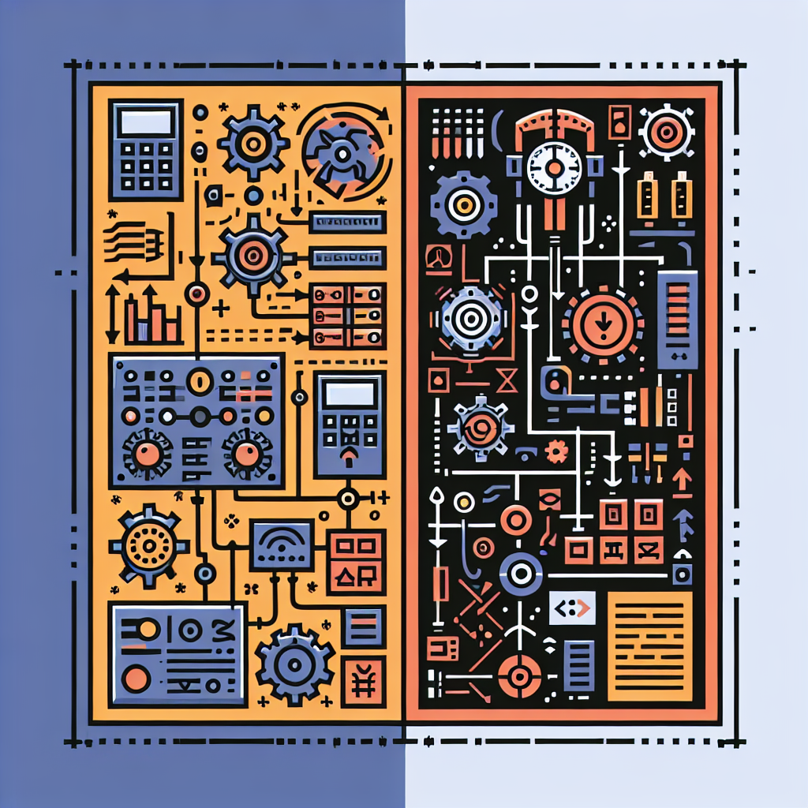

<!--
author: Benjamin Pietke
email: pietke@bszbautzen.de
comment: Lernfeld 7 - Mechatronik: Dieser Online-Kurs dient zur Unterstützung im Lernfeld-Unterricht am BSZ Bautzen.
logo: ./bilder/logo-lf7.png
icon: ./bilder/icon-bsz.png
classroom: enable
-->

# Mechatronische Teilsysteme

## Einführung

## Sensorik

## Baugruppen eines Netzteils

### Transformator

### Gleichrichter

#### Halbleiterbauelemente

### Glättung

### Stabilisierung

## Steuer- und Regelungstechnik

Herzlich willkommen im Abschnitt über Regelungstechnik! 🎓 In der Ausbildung zum Mechatroniker ist dieses Thema unerlässlich, da es euch grundlegende Prinzipien zur Steuerung und Regelung komplexer Systeme vermittelt.

Ihr lernt, wie Systeme automatisch reguliert werden, um Istwerte und Sollwerte richtig abzustimmen. 📏 Dabei spielt die Erfassung von Daten durch Sensoren und die Verarbeitung dieser Informationen zur Anpassung von Steuerungen eine zentrale Rolle. 🎛️

Ein wichtiger Aspekt ist das Verständnis von Regelkreisen und deren Komponenten. Ihr erfahrt, wie diese in verschiedenen Anwendungen, wie Industrieanlagen und Automatisierungssystemen, eingesetzt werden. 🔧 Zudem werdet ihr praktische Übungen durchführen, um euer theoretisches Wissen anzuwenden und zu vertiefen. 💻🔍

Die Kenntnisse in der Regelungstechnik sind entscheidend für eure berufliche Entwicklung und für die Effizienz moderner technischer Systeme. 🌍 Seid bereit, spannende Themen zu erkunden und euer Wissen zu erweitern! Viel Spaß beim Lernen! 📚✨


### Steuern vs. Regeln

Für ein erstes Verständnis zum Thema Regelungstechnik ist es wichtig, den technischen Unterschied zwischen "steuern" und "regeln" zu verinnerlichen.



Lesen Sie die beiden Definition nach DIN IEC 60050-351:

**Steuerung**

*"Das Steuern, die Steuerung, ist ein Vorgang in einem System, bei dem eine oder mehrere Größen als Eingangsgrößen, andere Größen als Ausgangs- bzw. Steuergrößen aufgrund der dem System eigentümlichen Gesetzmäßigkeiten beeinflussen.*

*Kennzeichen für das Steuern ist entweder der offene Wirkungsweg oder ein zeitweise geschlossener Wirkungsweg, bei dem die durch die Eingangsgrößen beeinflussten Ausgangsgrößen nicht fortlaufend und nicht wieder über dieselben Eingangsgrößen auf sich selbst wirken."*

**Regelung**

*"Die Regelung bzw. das Regeln ist ein Vorgang, bei dem fortlaufend eine Größe, die Regelgröße, erfasst, mit einer anderen Größe, der Führungsgröße, verglichen und im Sinne einer Angleichung an die Führungsgröße beeinflusst wird.*

*Kennzeichen für das Regeln ist der geschlossene Wirkungsablauf, bei dem die Regelgröße im Wirkungsweg des Regelkreises fortlaufend sich selbst beeinflusst."*

**📝 AUFGABE**

Erläutern Sie anhand der folgenden Beispiele den Unterschied zwischen "Steuern" und "Regeln":

- Geschwindigkeit eines Autos
- Navigation per Maps
- Backofen in der Küche

**📝 AUFGABE**

Grenzen Sie die Begriffe "Steuerung" und "Regelung" mit Ihren eigenen Worten gegeneinander ab.

### Blockschaltbild

Eine Regelung wird meist schematisch als **Blockschaltbild** anhand der Struktur eines **Regelkreises** dargestellt.

**📝 AUFGABE**

Übernehmen Sie das Blockschaltbild und ergänzen Sie die Begriffe für die einzelnen Elemente. Nutzen Sie die Informationen in Ihrem Tabellenbuch!


``` ascii
+------------+   +---------+   +--------+
|            |   |         |   |        |
| Leerer     +-->| Platz-  +-->| halter |
|            |   |         |   |        |
+------------+   +---------+   +--------+
```

Ergänzen Sie die Bedeutung der verschiedenen Kenngrößen eines Regelkreises und tragen Sie diese an der passenden Stelle im Blockschaltbild ein.

| Kenngröße | Bedeutung        |
|-----------|------------------|
| x         |  |
| w         |  |
| e         |  |
| z         |  |
| y         |  |
| r         |  |

**✅ KONTROLLE**

Lösen Sie die LearningApp [Blockschaltbild Regelkreis](https://learningapps.org/watch?v=ptu8z0cwa19).
[qr-code](https://learningapps.org/watch?v=ptu8z0cwa19)

### Verhalten einer *guten* Regelung

**📝 AUFGABE**

Betrachten wir nochmal das Beispiel vom Abschnitt **Steuern vs. Regeln**. Nennen Sie verschiedene Kriterien, die Sie zur Beurteilung einer *guten* Regelung bewerten würden:

- Geschwindigkeit eines Autos
- Navigation per Maps
- Backofen in der Küche

### Übergangsfunktion eines Regelkreises ###


**Sprungantwort**

**Imoulsantwort**


